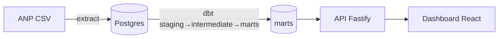

# radar-combustiveis

Dashboard ao vivo de preços de combustíveis da ANP, alimentado por um ELT semanal: GitHub Actions → Postgres → API Fastify → dashboard React.

## Arquitetura

🚧 Diagrama em construção.



## Stack

- **Pipeline:** Python + dbt-postgres (Postgres 16 local via Docker; Neon em prod).
- **API:** Fastify + TypeScript.
- **Web:** React + TypeScript + Vite.
- **Contratos:** tipos compartilhados em `packages/contracts` (api e web consomem os mesmos tipos).

## Quickstart

```bash
cp .env.example .env          # Windows: copy .env.example .env
docker compose up -d          # sobe o Postgres local (aguarde "healthy")
pnpm install                  # instala o workspace (api, web, contracts)
```

Pipeline (dbt) — requer um venv com dbt-postgres:

```bash
python -m venv pipeline/.venv
pipeline/.venv/Scripts/python -m pip install -r pipeline/requirements.txt   # Linux/mac: pipeline/.venv/bin/python
cd pipeline/dbt && dbt parse
```

Dev:

```bash
pnpm --filter api dev         # API (porta 3333) → GET /health
pnpm --filter web dev         # dashboard (placeholder)
pnpm -r test                  # testes
```

## Estrutura

```
pipeline/   Python (extract) + projeto dbt em pipeline/dbt (staging→intermediate→marts)
api/        API Fastify (TypeScript)
web/        dashboard React (TypeScript + Vite)
packages/   contracts — tipos compartilhados api ↔ web
.claude/    skills, agents e hooks do Claude Code
docker-compose.yml   Postgres 16 local
```

## Roadmap

🚧 Entrega em etapas. ETAPA 1 (fundação/scaffold) concluída. Próximas: pipeline ELT, endpoints da API, dashboard, deploy.
