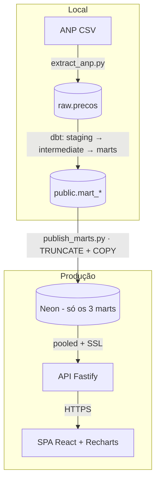

# radar-combustiveis

[](https://github.com/joaomatana/radar-combustiveis/actions/workflows/ci.yml)

Dashboard **ao vivo** de preços de combustíveis da ANP (Brasil) - da extração ao gráfico. Um ELT semanal carrega a série histórica num Postgres, o **dbt** modela os marts, uma **API Fastify** tipada serve, e um **SPA React** desenha. Monorepo: `pipeline` (Python/dbt) · `api` (Fastify/TS) · `web` (React/TS) · `packages/contracts` (tipos compartilhados).

**🔗 Demo:** `https://radar-combustiveis.vercel.app/` &nbsp;·&nbsp; **API:** `https://radar-combustiveis.onrender.com/health`

## Arquitetura

O ELT roda **local** (a máquina tem espaço pro `raw` inteiro); só os **3 marts** pequenos sobem pro Neon. A API e o SPA só **leem**.



**4 views:** preço médio (com banda min/max), variação mês a mês, dispersão entre revendas e ranking por UF.

## A história (decisões de engenharia)

O design *começou* como um cron do GitHub Actions fazendo o ELT direto no Neon (`dbt build --target prod`). Dois limites reais derrubaram isso:

1. **gov.br bloqueia o runner.** Runners do GitHub têm egress só-IPv4 e o `www.gov.br` resolve p/ IPv6 → `ENETUNREACH`; mesmo com IPv4 forçado, o IP de datacenter é barrado. A extração precisa de um IP residencial BR → roda **local**.
2. **Neon free = 512 MB.** A série histórica (`raw`, milhões de linhas) estoura o teto. Então o `raw` fica **local** e só os **3 marts** (uns milhares de linhas) vão pro Neon.

→ **Pivot:** ELT local + publicar só os marts. O cron do GitHub ([`cron-elt.yml`](.github/workflows/cron-elt.yml)) ficou **desativado, como referência** do design ELT→prod original.

Padrões defensivos - **garantia em código, não em runbook** (cada um nasceu de um bug que "verde local" não pegava):

- **`resolveSsl()`** decide o TLS do Neon explicitamente (não confia no parsing de `sslmode` do `pg`, que muda no v9).
- A API consulta **`FROM public.mart_*` qualificado** - não depende de `search_path`/pooler.
- O `extract` é **IPv4-only** (o runner não roteia IPv6) e **recusa qualquer host `neon.tech`** - o ELT nunca toca o prod.
- O `publish_marts.py` é **atômico** (TRUNCATE + COPY dos 3 marts num só commit) e **recusa origem == destino**.

## Stack

| Camada | Tech |
| --- | --- |
| **Pipeline** | Python + dbt-postgres (medallion: staging → intermediate → marts); `extract` via psycopg2/COPY |
| **API** | Fastify 5 + TypeScript estrito + Zod; `pg` cru parametrizado (marts são read-only do dbt) |
| **Web** | React 19 + Vite + Recharts 3 + Tailwind v4; só `import type` de `contracts` → **zod fora do bundle** |
| **Contracts** | Zod como fonte única - api e web consomem os **mesmos** tipos (`packages/contracts`) |

## Rodando local

```bash
cp .env.example .env            # Windows: copy .env.example .env
docker compose up -d            # Postgres local na :5433 (aguarde "healthy")
pnpm install                    # workspace (api, web, contracts)
```

**Refresh dos dados** - ELT local → publica os marts no Neon:

```bash
python pipeline/extract/extract_anp.py      # baixa a ANP → raw.precos (local)
cd pipeline/dbt && dbt build && cd ../..     # staging→marts (local) + testes
python pipeline/publish/publish_marts.py     # publica os 3 marts no Neon
```

> **Env:** `DATABASE_URL` aponta p/ o **Postgres local** (extract/dbt); `NEON_DATABASE_URL` (endpoint *direct*) é **só** do `publish`. Se você setar `DATABASE_URL=neon` (ex.: testar a API local contra o Neon), o `extract` **recusa** rodar - proposital, p/ o `raw` nunca ir pro Neon.

**Dev:**

```bash
pnpm --filter api dev      # API na :3333 → GET /health
pnpm --filter web dev      # dashboard na :5173
pnpm -r test               # testes (api + web)
```

## Testes & CI

`pnpm -r` roda **biome** (lint/format), **typecheck**, **build** e **testes** (api 16 / web 22). O [CI](.github/workflows/ci.yml) tem dois jobs: `build` (o acima) e `pipeline` (sobe um Postgres, carrega *fixtures* determinísticas, roda `dbt build` = 6 modelos + 33 testes, e gera o **perfil dos marts**).

## 📊 Perfil dos dados

Gerado por [`pipeline/profile/profile_marts.py`](pipeline/profile/profile_marts.py) → [`pipeline/profile/profile.md`](pipeline/profile/profile.md) (dado real: **4833 linhas/mart, 27 UFs, 7 produtos, 2024-01 → 2026-03**). Trecho do `mart_preco_medio_uf_mes` - o `max` alto é o GLP (vendido por botijão de 13 kg, ~R$140) vs. ~R$6/litro dos combustíveis:

```
       preco_medio_venda  preco_min_venda  preco_max_venda  qtd_coletas  qtd_municipios
count           4833.000         4833.000         4833.000     4833.000        4833.000
mean              21.540           18.352           25.554      462.712          13.153
min                3.007            2.630            3.540        1.000           1.000
max              141.789          130.000          170.000     6054.000         109.000
```

## Estrutura

```
pipeline/   extract (Python) + projeto dbt (staging→intermediate→marts) + profile + publish
api/        API Fastify (TypeScript) sobre os marts
web/        dashboard React (Vite + Recharts)
packages/   contracts - tipos Zod compartilhados api ↔ web
docker-compose.yml   Postgres 16 local (:5433)
```

## Deploy

Neon (marts) + Render (API) + Vercel (SPA). Runbook completo em [DEPLOY.md](DEPLOY.md).
